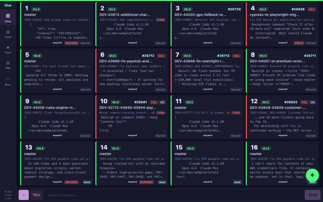

# hive

Command your AI coding fleet from your phone.

hive is a real-time dashboard and control plane for managing multiple [Claude Code](https://docs.anthropic.com/en/docs/claude-code) sessions running in tmux. See what every session is doing, send messages, trigger slash commands, manage a task queue, and get notified when things finish — all from a mobile-first web UI or Telegram.



## Why

If you run multiple Claude Code sessions in parallel (code reviews, feature work, CI fixes, tests), you need a way to monitor and steer them without switching between 16 terminal tabs. hive gives you a single screen with live status for every session, plus the ability to interact with any of them instantly.

## Features

### Dashboard
- **Fleet grid** — See all sessions at a glance with state (idle/working/off), branch, PR number, CI status, review badges, and terminal previews
- **Live terminal** — Tap a session to view its terminal output with full ANSI colors via xterm.js, refreshing every 2 seconds
- **Ask/Tell** — Send messages to any Claude session. Ask waits for a response; Tell is fire-and-forget
- **Key buttons** — Send Enter, Escape, arrow keys, Tab, y/n, or number keys to answer Claude's prompts
- **Slash commands** — Auto-discovered from your `~/.claude/commands/` directory, rendered as tap-to-send buttons
- **Quick send** — Message a session directly from the grid without opening the detail view
- **Git tab** — View branch diffs, commit history, staged/unstaged changes per session
- **Fleet search** — Search across all session terminal contents

### Task Queue
- **Auto/Manual dispatch** — Create tasks that auto-assign to idle sessions or target a specific one
- **Designations** — Tag sessions (frontend, backend, tests, reviews, etc.) and route tasks to matching sessions
- **Auto-pilot rules** — Auto-fix CI failures, address review feedback, pick next task on idle
- **Task session panel** — Live terminal view for dispatched tasks with full key/message controls
- **Broadcast** — Send a message to all, idle, or working sessions at once

### Approvals
- **Permission detection** — Automatically detects when Claude is asking for permission (tool approvals, file edits, etc.)
- **One-tap approve/deny** — Resolve permission prompts from the dashboard without switching terminals

### Activity Feed
- **Real-time event log** — Session state changes, task dispatch/completion, CI results, approvals
- **Session previews** — Click a feed entry to preview what that session is showing
- **Quick actions** — Approve, send messages, or open sessions directly from feed entries

### VIM Mode
- **Global toggle** — Persisted setting that controls whether relay sends `Escape + i` before text input
- **ON:** Relay prepends Escape+i to ensure INSERT mode before typing messages via ask/tell
- **OFF (default):** Messages sent directly — no preamble. Keys bar always sends raw keys regardless.

### Project Managers
- **Automated workflows** — Define JIRA-driven or manual project managers that poll for work and create tasks
- **Configurable instructions** — Each PM has a name, poll interval, and instructions template
- **Enable/disable** — Toggle PMs on and off from the dashboard

### Multi-Computer Fleet
- **Remote workers** — Run `hive-worker` on additional machines to extend your fleet across computers
- **WebSocket RPC** — Workers connect to the hive server and execute tmux/file commands on their local sessions
- **Node router** — Commands are transparently routed to the correct machine

### Notifications
- **Toast notifications** — In-app popups for task completion, CI changes, errors
- **Browser notifications** — Native OS notifications when sessions go idle or CI finishes
- **Telegram bot** — Full fleet control via Telegram for when you're away from the dashboard

### Other
- **PWA** — Installable as a home screen app on iOS/Android
- **Configurable links** — PR and CI badge URLs are templates in config, not hardcoded
- **Spawn agents** — Dynamically create new tmux sessions (slots 17-32) with optional git clone
- **Restart sessions** — Restart Claude (`/exit` + `claude --resume`) from the dashboard

## Architecture

```
┌─────────────────────────────────────────────────────┐
│  Your phone / browser                               │
│  ┌──────────────┐  ┌─────────────────────────────┐  │
│  │ Web dashboard │  │ Telegram bot                 │  │
│  └──────┬───────┘  └──────────┬──────────────────┘  │
└─────────┼──────────────────────┼────────────────────┘
          │ WebSocket            │ Telegram API
          ▼                      ▼
┌─────────────────────────────────────────────────────┐
│  hive server (Node.js)                              │
│  ┌──────────┐ ┌────────┐ ┌─────────┐ ┌──────────┐  │
│  │ fleet.js │ │relay.js│ │watcher.js│ │taskqueue │  │
│  └────┬─────┘ └───┬────┘ └────┬────┘ └────┬─────┘  │
│       └────────────┼──────────┼────────────┘        │
│                    ▼          ▼                      │
│              ┌──────────────────┐                    │
│              │  Node Router     │                    │
│              └──┬───────────┬──┘                    │
└─────────────────┼───────────┼───────────────────────┘
                  │           │
          ┌───────┘           └──────────┐
          ▼                              ▼
┌──────────────────────┐  ┌─────────────────────────┐
│  Local tmux sessions │  │  Remote worker machines  │
│  ┌───┐ ┌───┐ ┌───┐  │  │  (via WebSocket RPC)     │
│  │ 1 │ │ 2 │ │...│  │  │  ┌───┐ ┌───┐ ┌───┐      │
│  └───┘ └───┘ └───┘  │  │  │17 │ │18 │ │...│      │
└──────────────────────┘  │  └───┘ └───┘ └───┘      │
                          └─────────────────────────┘
```

Each tmux session runs Claude Code in a pane. hive reads terminal content via `tmux capture-pane`, detects idle/working state from screen patterns, and sends input via `tmux send-keys`. No modifications to Claude Code itself.

## Requirements

- **Node.js** 18+
- **tmux** 3.2+ with numbered sessions
- **tmuxinator** for session templates (optional but recommended)
- **Claude Code** running in a pane within each tmux session
- **gh** CLI for PR/CI data (optional)
- Optional: Telegram bot token for the Telegram integration

### Installing tmux and tmuxinator

**macOS:**
```bash
brew install tmux
gem install tmuxinator --user-install
```

**Ubuntu/Debian:**
```bash
sudo apt install tmux
gem install tmuxinator --user-install
```

After installing tmuxinator via `--user-install`, you may need to add the gem bin directory to your PATH. Check `gem environment gemdir` for the location and add its `bin/` subdirectory to your shell profile.

> **New to this?** See the **[full setup guide](docs/setup-guide.md)** for step-by-step instructions covering tmux configuration, session templates, background daemons, and phone access.


## Quick start

```bash
git clone https://github.com/nukulb/hive.git
cd hive
npm install

# Configure
cp .env.example .env
# Edit .env — set WEB_TOKEN (required), optionally TELEGRAM_BOT_TOKEN and TELEGRAM_CHAT_ID

# Edit hive.config.js to match your tmux layout
# (session naming pattern, pane index, repo directories, etc.)

# Start tmux sessions (requires tmuxinator)
node start-sessions.js

# Start hive
npm start
# → Web dashboard: http://localhost:3000
```

`start-sessions.js` reads `sessions.repoDir` and `sessions.roles` from `hive.config.js` and launches a tmux session per slot using the included `worker.yml` tmuxinator template. Each session gets Claude Code in pane 0 with two utility panes alongside it.

You can also start individual sessions: `node start-sessions.js 1 3`

Open `http://localhost:3000` on your phone (same network), enter your token, and you're in.

## Configuration

### `.env`

```bash
# Required for web dashboard
WEB_PORT=3000
WEB_TOKEN=your-secret-token

# Optional — Telegram bot
TELEGRAM_BOT_TOKEN=your-bot-token
TELEGRAM_CHAT_ID=your-chat-id

# Optional — Remote workers (multi-computer setup)
# HIVE_WORKER_SECRET=your-shared-secret
```

### `hive.config.js`

```javascript
module.exports = {
  sessions: {
    // Regex to match your tmux session names
    pattern: /^\d+/,

    // Map session number → repo directory
    repoDir: (n) => `/home/you/projects/repo${n}`,

    // Which pane index (0-based) runs Claude Code
    claudePane: 0,

    // Optional fixed roles for display
    roles: { 1: 'Reviews', 2: 'Ideas', 3: 'Urgent', 4: 'Tests' },
  },

  // Patterns in terminal output that mean Claude is waiting for input
  idlePatterns: [
    /bypass permissions/,
    /shift\+tab/,
    /ctrl-g to edit/,
  ],

  // Patterns that mean Claude isn't running
  offPatterns: [
    /conversation\./,
  ],

  // PR/CI cache files (if you use external cache-warming scripts)
  cache: {
    statusPrefix: '/tmp/tmux-status-',
    stateDir: '/tmp/tmux-claude-states',
  },

  relay: {
    pollInterval: 2000,    // How often to check for response
    cooldown: 5000,        // Wait after idle before declaring done
    timeout: 5 * 60 * 1000, // Max wait time
  },

  watcher: {
    interval: 10000,       // How often to poll fleet status
  },

  // URL templates for PR and CI links (use ${prNum} and ${ciBuild})
  links: {
    pr: 'https://github.com/your-org/your-repo/pull/${prNum}',
    ci: 'https://ci.example.com/job/your-repo/job/PR-${prNum}/${ciBuild}/',
  },
};
```

## Task queue

Tasks are the main way to automate work across your fleet.

### Creating tasks

From the dashboard, click **+ Task** to open the task dialog. Enter a description (supports multi-line — Cmd+Enter to submit), choose a designation filter, and pick auto or manual mode.

- **Auto mode** — Task goes into a queue. hive assigns it to the next idle session that matches the designation. The session gets `/clear` first, then the task text is sent.
- **Manual mode** — Pick a specific session. The task is dispatched immediately.

### Auto-dispatch flow

1. Task created with `mode: auto`
2. hive checks for idle sessions that are opted into auto-mode
3. If a task has a designation (e.g. "backend"), only sessions with that designation are eligible
4. Session gets `/clear` → waits 2.5s → task text sent via `relay.tell()`
5. When the session goes idle again, the task is marked complete

### Designations

Tag sessions with roles like `frontend`, `backend`, `tests`, `reviews`, etc. Tasks with a matching designation only dispatch to sessions with that tag. Tasks with no designation go to any auto-enabled session.

### Auto-pilot rules

- **Auto-pick next task on idle** (default: enabled) — When a session finishes and goes idle, dispatch the next queued task
- **Auto-fix CI failures** — When CI fails, create a fix task for that session
- **Auto-address review changes** — When PR review requests changes, create a task to address feedback

## VIM mode

If your Claude Code terminal uses vim keybindings, toggle VIM mode ON. This makes `relay.ask()` and `relay.tell()` send `Escape → i` before typing text, ensuring the TUI is in INSERT mode.

**Default is OFF.** Keys bar buttons always send raw keys regardless of VIM mode setting.

The setting persists across server restarts (stored in `.hive-state.json`).

## Remote workers

To extend your fleet across multiple computers:

**On the hive server machine:**
1. Set `HIVE_WORKER_SECRET=your-secret` in `.env`
2. Start normally: `npm start`

**On each worker machine:**
1. Clone hive and install dependencies
2. Run: `npx hive-worker --server ws://hive-host:3000 --secret your-secret --node-id worker1`

The worker connects via WebSocket and registers itself. All tmux commands for sessions on that machine are routed through the worker's RPC connection.

## Slash commands

hive auto-discovers Claude Code slash commands from `~/.claude/commands/` and renders them as buttons in the session detail view. Any `.md` file with YAML frontmatter (`name`, `description`) becomes a tappable command.

If your project also has `.claude/commands/` in the repo directory, those are discovered too (project commands override global ones with the same name).

## tmux session layout

hive expects numbered tmux sessions where Claude Code runs in a specific pane. Example layout:

```
┌────────────────────┬──────────────┐
│                    │   server     │
│   Claude Code      │   (pane 1)   │
│   (pane 0)         ├──────────────┤
│                    │   shell      │
│                    │   (pane 2)   │
└────────────────────┴──────────────┘
```

Set `sessions.claudePane` in config to match whichever pane runs Claude.

## State persistence

hive persists its state to `.hive-state.json` in the project root. This includes:

- Auto-mode session set
- Session designations
- Auto-pilot rule toggles
- Active tasks (queued + dispatched — completed/cancelled/failed are dropped)
- Dispatched task session assignments (reattach on restart without re-dispatch)
- Spawned agent slots
- VIM mode setting
- Project manager configurations

On restart, dispatched tasks reattach to their running tmux sessions. No `/clear` is sent, no re-dispatch happens — the server just resumes monitoring.

## Project structure

```
hive/
├── hive.config.js              # Your fleet configuration
├── worker.yml                  # Tmuxinator template for session layout
├── start-sessions.js           # Launch tmux sessions from config
├── .env                        # Secrets (not committed)
├── .hive-state.json            # Persisted state (auto-generated)
├── src/
│   ├── index.js                # Entry point — wires everything together
│   ├── worker.js               # Remote worker node process
│   ├── core/
│   │   ├── fleet.js            # Fleet status queries (sessions, git, PR, CI)
│   │   ├── relay.js            # Send messages to Claude (ask with polling, tell fire-and-forget)
│   │   ├── taskqueue.js        # Task queue, auto-dispatch, approvals, rules, VIM mode, broadcast
│   │   ├── tmux.js             # tmux helpers (capture, send-keys, state detection)
│   │   ├── watcher.js          # EventEmitter — polls fleet, emits state/CI/review changes
│   │   ├── git.js              # Git operations (log, diff, branch info, changed files)
│   │   ├── pm.js               # Project manager (automated JIRA/manual workflows)
│   │   ├── local-node.js       # Local command execution (exec, readFile, capturePane)
│   │   ├── remote-node.js      # Remote command execution via WebSocket RPC
│   │   └── node-router.js      # Routes commands to correct node (local or remote)
│   └── integrations/
│       ├── telegram/            # Telegram bot integration
│       │   ├── bot.js           # Bot setup and middleware
│       │   └── commands.js      # /fleet, /peek, /ask, /tell, etc.
│       └── web/                 # Web dashboard integration
│           ├── server.js        # Express + WebSocket server, all message handlers
│           └── public/
│               ├── index.html   # Single-file frontend (HTML + CSS + JS)
│               ├── manifest.json # PWA manifest
│               └── sw.js        # Service worker
└── package.json
```

## Sandboxed user (recommended)

Claude Code sessions run as your user and inherit all your credentials — SSH keys, AWS config, sudo access, macOS Keychain. A sandboxed user isolates AI sessions so they can only access dev resources, even if Claude tries to reach production.

### Create the sandbox user

Create a system user in the same group as your main user (e.g. `staff` on macOS):

```bash
# macOS example — adjust for your OS
sudo dscl . -create /Users/hivebot
sudo dscl . -create /Users/hivebot UserShell /bin/zsh
sudo dscl . -create /Users/hivebot RealName "Hive Bot"
sudo dscl . -create /Users/hivebot UniqueID 504
sudo dscl . -create /Users/hivebot PrimaryGroupID 20   # staff group
sudo dscl . -create /Users/hivebot NFSHomeDirectory /Users/hivebot
sudo mkdir -p /Users/hivebot
sudo chown hivebot:staff /Users/hivebot
```

### Passwordless sudo to the sandbox user

Allow your user to run commands as hivebot without a password:

```bash
echo "youruser ALL=(hivebot) NOPASSWD: ALL" | sudo tee /etc/sudoers.d/hivebot
```

This is downward-only access — hivebot cannot sudo to your user or root.

### SSH key (dev-only)

The sandbox user gets its own SSH key — no production `.pem` files, no access to your SSH config:

```bash
sudo -u hivebot mkdir -p /Users/hivebot/.ssh
sudo -u hivebot ssh-keygen -t ed25519 -f /Users/hivebot/.ssh/id_ed25519 -N "" -C "hivebot-dev"
sudo cp ~/.ssh/known_hosts /Users/hivebot/.ssh/known_hosts
sudo chown hivebot:staff /Users/hivebot/.ssh/known_hosts
```

Add the public key to GitHub (Settings > SSH Keys).

### Install dependencies as hivebot

Set up the sandbox user's shell profile and install tools:

```bash
# Shell profile — add ruby/gem paths (needed for tmuxinator)
sudo -u hivebot -H bash -c 'cat > ~/.zprofile << '\''EOF'\''
export PATH="/usr/local/opt/ruby@3.2/bin:$HOME/.local/share/gem/ruby/3.2.0/bin:$PATH"
export EDITOR="vi"
EOF'

# Install tmuxinator
sudo -u hivebot -i gem install tmuxinator --user-install

# Install Claude Code
sudo -u hivebot -i sh -c 'curl -fsSL https://claude.ai/install.sh | sh'

# Git identity
sudo -u hivebot -i git config --global user.name "Your Name (hivebot)"
sudo -u hivebot -i git config --global user.email "you@example.com"
sudo -u hivebot -i git config --global --add safe.directory '*'

# Authenticate Claude Code (interactive — opens browser)
sudo -u hivebot -i claude

# Skip permission prompts (safe in sandbox — hivebot has no prod access)
echo '{ "defaultMode": "bypassPermissions" }' | sudo -u hivebot tee ~/.claude/settings.json
```

### Clone repos and install hive

Everything lives under the sandbox user's home directory. `hive.config.js` uses `os.homedir()` so paths resolve automatically.

```bash
# Clone hive
sudo -u hivebot -i git clone git@github.com:nukulb/hive.git ~/git/hive
sudo -u hivebot -i sh -c 'cd ~/git/hive && npm install'

# Clone your managed repos
sudo -u hivebot -i git clone git@github.com:your-org/your-repo.git ~/ai-dev/your-repo1
# ... repeat for each repo

# Enable group write so your main user can also access these repos
sudo chmod -R g+w /Users/hivebot/ai-dev /Users/hivebot/git/hive
```

Configure hive: copy `.env.example` to `.env` and edit `hive.config.js` as described in [Configuration](#configuration).

### Run hive as the sandbox user

`start-hive.sh` launches the tmux sessions and starts the hive server in the background:

```bash
sudo -u hivebot /Users/hivebot/git/hive/start-hive.sh
# → hive server started (pid 12345, log /Users/hivebot/hive.log)
```

The server writes to `~/hive.log` and its pid to `~/hive.pid` (relative to the sandbox user's home). To restart the server (e.g. after a config change):

```bash
kill $(cat /Users/hivebot/hive.pid)
sudo -u hivebot /Users/hivebot/git/hive/start-hive.sh
```

You generally don't need to restart the tmux sessions. They hold running Claude Code instances with conversation history and in-progress work — killing a session kills Claude and loses that context. Only kill sessions if you need to change the tmux layout or re-clone repos:

```bash
sudo -u hivebot tmux kill-server           # destroys all sessions — use sparingly
```

> **Note:** `sudo -u hivebot` inherits your current working directory. If you're in a directory the sandbox user can't access (e.g. your home), the command will fail with a `getcwd` error. Run from `/tmp` or any shared directory, or use `sudo -u hivebot -i` which starts in the sandbox user's home.

### Privileged access

Your main user can still read and write the same repos via group permissions (`chmod g+w`). For tasks that need production SSH keys, AWS credentials, or sudo, run Claude Code manually as your own user:

```bash
# Same repos, different blast radius
cd /Users/hivebot/ai-dev/your-repo1
claude
```

Symlinks from your home directory make this convenient:

```bash
ln -s /Users/hivebot/ai-dev ~/ai-dev
```

### Service access (optional)

Your fleet may need access to external services. Each guide covers minimal-permission setup:

- **[GitHub](docs/sandbox-github.md)** — fine-grained token for push, PRs, and issues (no admin)
- **[JIRA](docs/sandbox-jira.md)** — API token for tickets and comments (service account recommended)
- **[AWS](docs/sandbox-aws.md)** — IAM user for CI/CD logs and deployment status (read-only by default)

### Verify the sandbox

Run the access audit script as both users to compare blast radius:

```bash
./check-access.sh                          # your user
sudo -u hivebot -H ./check-access.sh      # sandbox user
```

### What the sandbox user CAN'T access

- Your `~/.ssh/` directory (700, owner-only) — no production keys or SSH config
- `sudo` — hivebot has no sudo privileges
- macOS Keychain — per-user, no access to your stored credentials
- AWS credentials in your home directory

## Adding integrations

hive's core layer (`fleet`, `relay`, `tmux`, `watcher`, `taskqueue`) is integration-agnostic. To add a new integration (Slack, Discord, CLI, etc.):

1. Create `src/integrations/yourservice/`
2. Export a setup function that takes `(config, watcher, taskQueue, router)`
3. Use `fleet.getFleetStatus(config, router)` for status
4. Use `relay.ask()` / `relay.tell()` for messaging (pass `{ vimMode }` option)
5. Listen to watcher events: `session:idle`, `session:working`, `ci:changed`
6. Listen to taskQueue events: `task:created`, `task:completed`, `feed:new`, `approval:new`
7. Wire it into `src/index.js`

## WebSocket API

The dashboard communicates with the server via WebSocket messages (JSON). Key message types:

| Client → Server | Description |
|---|---|
| `auth` | Authenticate with token |
| `fleet:get` | Request fleet status |
| `fleet:search` | Search terminal contents across all sessions |
| `peek` | Get terminal snapshot for a session |
| `terminal:subscribe` / `unsubscribe` | Live terminal polling (2s) |
| `ask` / `tell` | Send message to Claude |
| `keys` | Send raw tmux keys (Enter, Escape, Up, Down, etc.) |
| `restart` | Restart Claude in a session |
| `task:create` / `task:cancel` / `task:complete` | Task lifecycle |
| `auto:toggle` / `auto:set` | Auto-mode session management |
| `designation:set` | Set session designation |
| `vim:toggle` | Toggle VIM mode |
| `broadcast` | Send message to multiple sessions |
| `approval:respond` | Approve or deny a permission prompt |
| `git:info` / `git:diff` / `git:commit` | Git operations |
| `spawn` | Create a new agent session |

| Server → Client | Description |
|---|---|
| `fleet:status` | Full fleet state (broadcast every 10s) |
| `terminal:data` | Terminal content update |
| `ask:stream` / `ask:done` | Ask response streaming |
| `task:created` / `task:dispatched` / `task:completed` | Task events |
| `feed:new` | New feed entry |
| `approval:new` / `approval:resolved` | Approval events |
| `vim:status` | VIM mode state sync |
| `notify` | Session state change notifications |

## License

[MIT](LICENSE)
